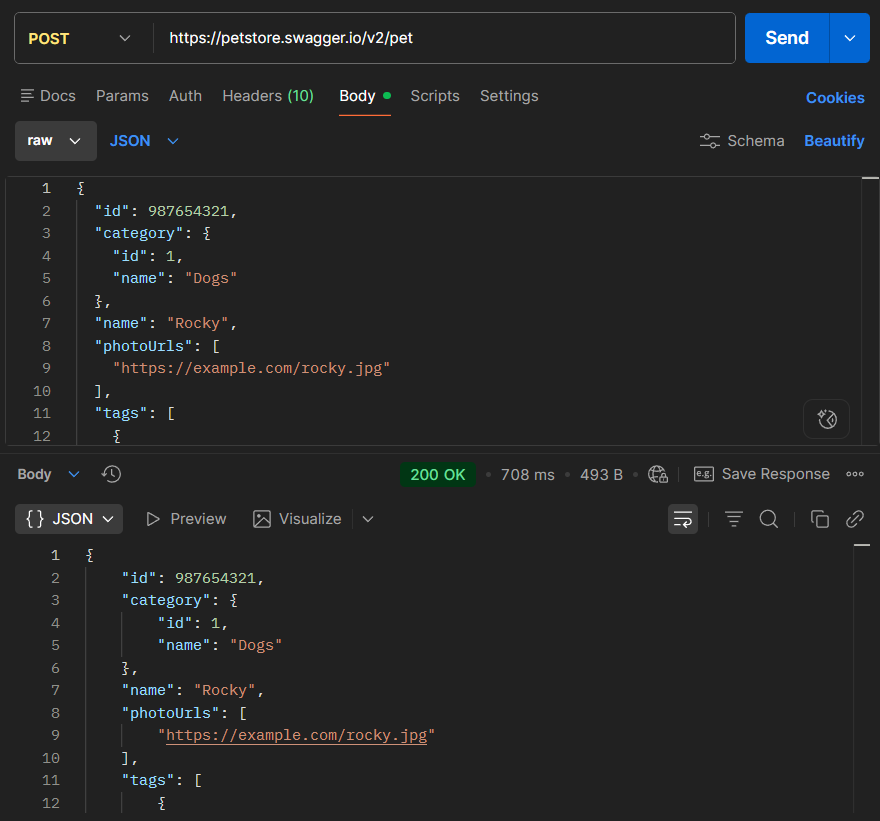
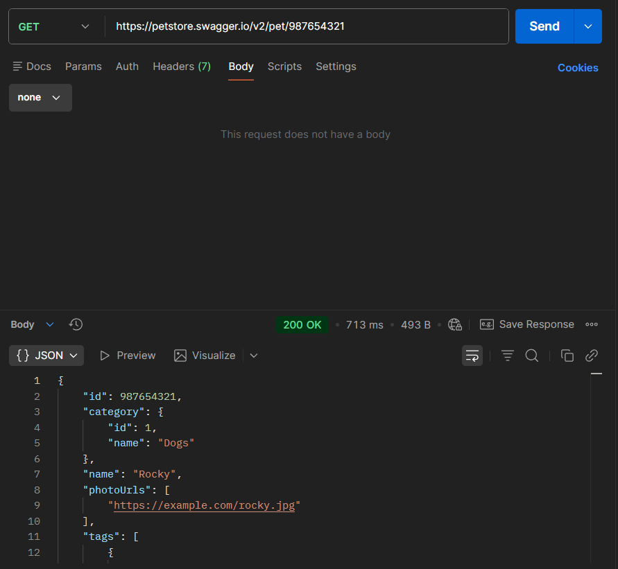
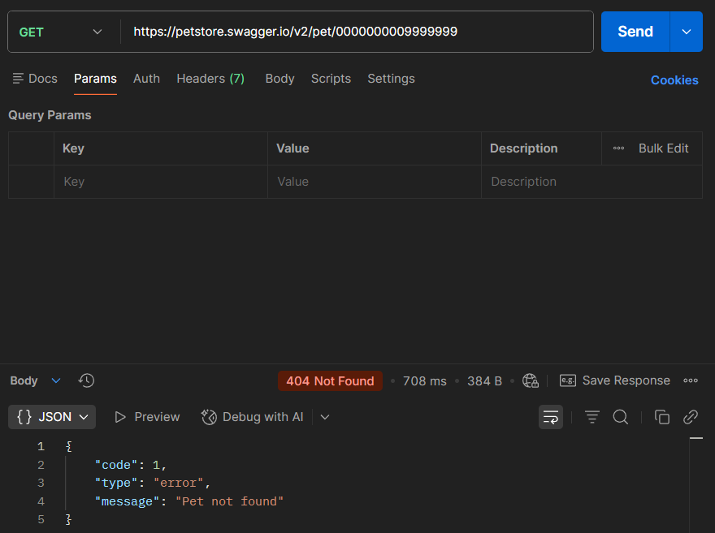
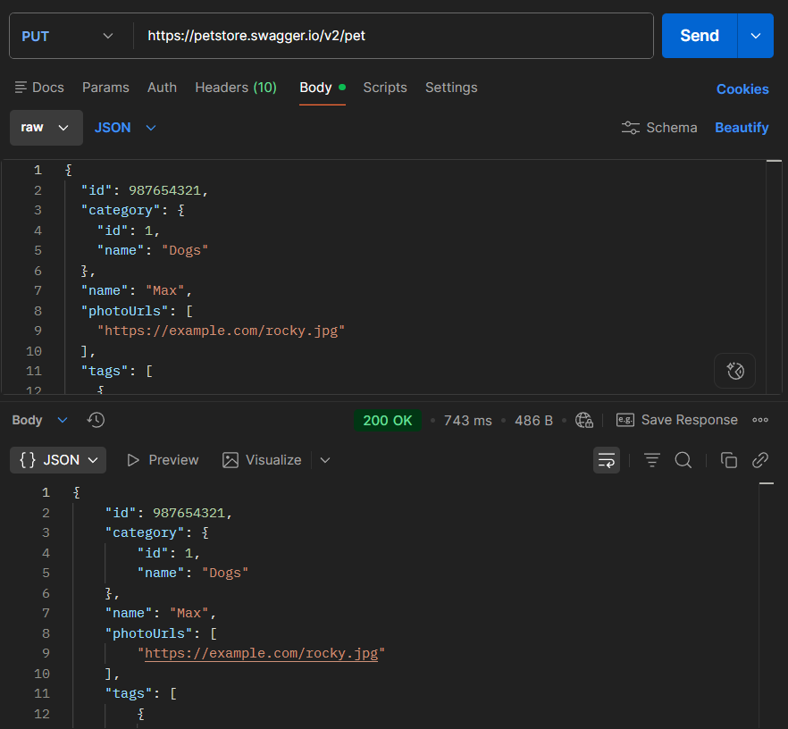
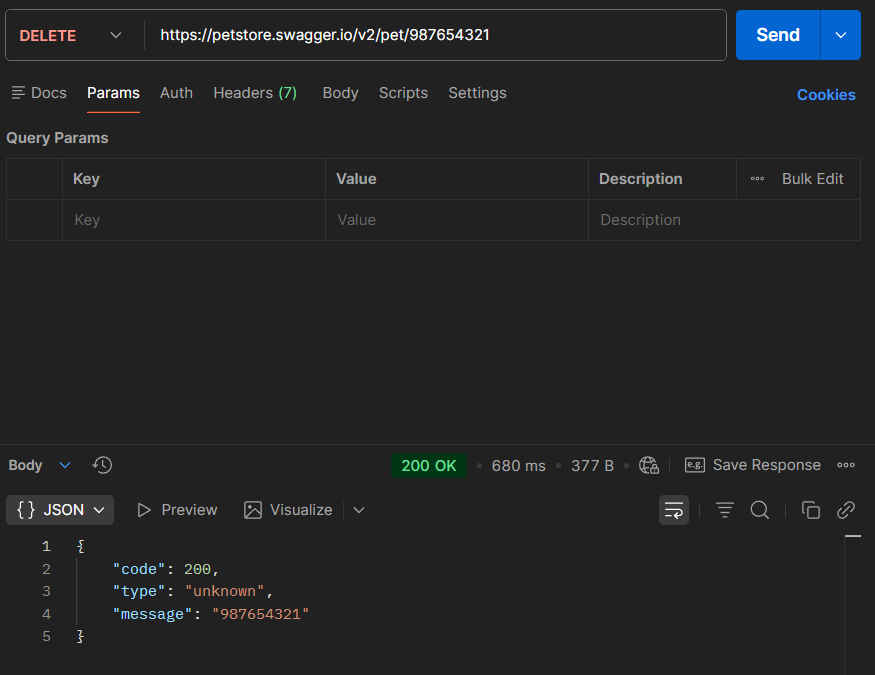
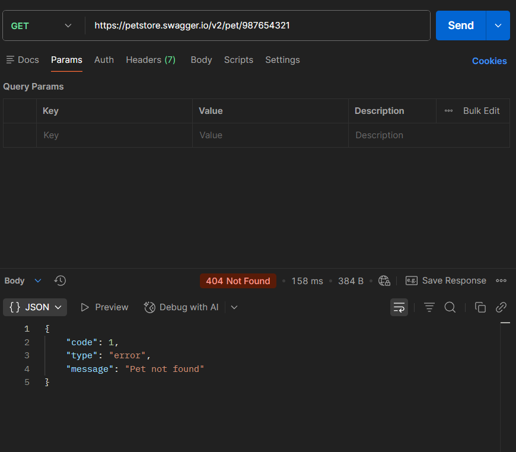

# API Testing — Casos de prueba 

## Caso API-01
**Objetivo:** 
Verificar la creación exitosa de una nueva mascota con datos válidos.

**Operación y endpoint:** 
`POST /pet`

**Precondiciones:** 
 Ninguna.

**Datos de entrada:**
json
{
  "id": 987654321,
  "name": "Rocky",
  "status": "available"
}
 
**Resultado esperado:**
Código HTTP 200 OK y respuesta JSON confirmando la creación con los mismos datos.

**Resultado obtenido:**
Código HTTP 200 OK. El cuerpo de la respuesta devuelve el ID 987654321 y el nombre "Rocky". Estado: Exitosa.

**Evidencia:**

## Caso API-02 
**Objetivo:** 
Obtener la información de una mascota existente mediante su ID.

**Operación y endpoint:** 
`GET /pet/{petId}`

**Precondiciones:**
 La mascota con ID 987654321 debe existir previamente.

**Datos de entrada:**
 petId = 987654321

**Resultado esperado:**
 Código HTTP 200 OK y el objeto JSON con la información de la mascota.

**Resultado obtenido:**
 Código HTTP 200 OK. Se retorna la información completa de la mascota. Estado: Exitosa.

**Evidencia:**

## Caso API-03
**Objetivo:**
 Verificar el comportamiento de la API al solicitar una mascota con un ID que no existe.

**Operación y endpoint:**
 `GET /pet/{petId}`

**Precondiciones:**
 El ID consultado no debe existir en la base de datos.

**Datos de entrada:**
 petId = 0000000009999999

**Resultado esperado:**
 Código HTTP 404 Not Found y mensaje de error indicando que no se encontró el recurso.

**Resultado obtenido:**
 Código HTTP 404 Not Found con respuesta {"code":1,"type":"error","message":"Pet not found"}. 
 Estado: Exitosa.

**Evidencia:** 

## Caso API-04
**Objetivo:**
 Actualizar el nombre y el estado de una mascota existente.

**Operación y endpoint:**
 `PUT /pet`

**Precondiciones:**
 La mascota con ID 987654321 debe existir.

**Datos de entrada:**
{
  "id": 987654321,
  "name": "Max",
  "status": "sold"
}

**Resultado esperado:**
 Código HTTP 200 OK y cuerpo JSON reflejando los cambios (name: "Max", status: "sold").

**Resultado obtenido:**
 Código HTTP 200 OK con los datos actualizados correctamente. Estado: Exitosa.

**Evidencia:**

## Caso API-05
**Objetivo:**
 Eliminar un registro de mascota existente por su ID.

**Operación y endpoint:**
 `DELETE /pet/{petId}`

**Precondiciones:**
 La mascota con ID 987654321 debe existir.

**Datos de entrada:**
 petId = 987654321

**Resultado esperado:**
 Código HTTP 200 OK.

**Resultado obtenido:**
 Código HTTP 200 OK. Estado: Exitosa.

**Evidencia:**

## Caso API-06
**Objetivo:**
 Confirmar que una mascota eliminada ya no es accesible.

**Operación y endpoint:**
 `GET /pet/{petId}`

**Precondiciones:**
 La mascota con ID 987654321 fue eliminada previamente en el Caso API-05.

**Datos de entrada:**
 petId = 987654321

**Resultado esperado:**
 Código HTTP 404 Not Found.

**Resultado obtenido:**
 Código HTTP 404 Not Found. Se confirma que el recurso fue removido. Estado: Exitosa.

**Evidencia:**

# Conclusiones 
## Resultados relevantes 
¿Qué resultados consideras más importantes y por qué? 
## Resultados relevantes 
El resultado más importante fue la validación exitosa del ciclo de vida completo de un recurso (CRUD) en la sección `/pet`, confirmando que la API responde de acuerdo con la especificación Swagger tanto en escenarios exitosos (`200 OK`) como en el manejo de recursos inexistentes (`404 Not Found`).

Esto es importante porque garantiza la integridad de los datos en el sistema (las mascotas se crean, leen, modifican y eliminan correctamente sin corrupción de información) y confirma que la API gestiona los errores de forma controlada sin exponer fallos internos ante peticiones inválidas.
## Limitaciones 
¿Qué aspectos no pudiste verificar? 
Al tratarse de un entorno público y compartido, existió la posibilidad de colisión de datos si otro usuario modificaba o eliminaba el ID utilizado. Por ello, se utilizaron IDs numéricos altos y poco comunes para minimizar interrupciones.
## Pruebas adicionales 
¿Qué otras pruebas realizarías si tuvieras más tiempo?

1. Pruebas de validación de esquemas JSON y tipos de datos (por ejemplo, enviar un string en el campo id).

2. Pruebas de seguridad (autenticación y autorización mediante API Key u OAuth).

3. Pruebas de carga para medir la latencia y resiliencia ante solicitudes concurrentes.